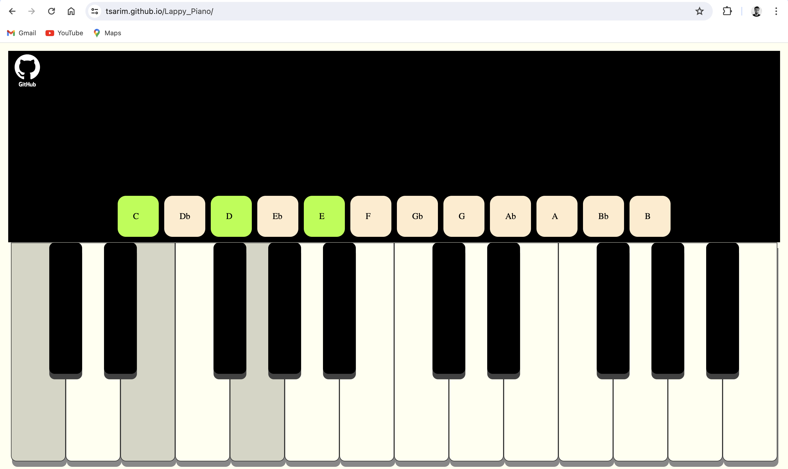

# Lappy_Piano
Web app that allows you to play piano using your laptop keyboard. Try it out!! https://tsarim.github.io/Lappy_Piano/

Note: For the best experience, use this on Chrome. Currently, the app experiences a significant delay on Safari.

 
<h3>How to use?</h3>
<h4>The following mapping is used:</h4>

key A -> note C3

key S -> note D3

key D -> note E3

key F -> note F3

key G -> note G3

key H -> note A3

key J -> note B3

key K -> note C4

key L -> note D4

key ; -> note E4

key N -> note F4

key M -> note G4

key , -> note A4

key . -> note B4

key W -> note Db3

key E -> note Eb3

key T -> note Gb3

key Y -> note Ab3

key U -> note Bb3

key I -> note Db4

key o -> note Eb4

key P -> note Gb4

key [ -> note Ab4

key ] -> note Bb4

the buttons on the panels are to play heavier notes when needed

 

mp3 files of piano notes were provided by <a href="https://github.com/fuhton">fuhton</a> on github 

Note: this app was meant to be used on a laptop/pc to mimic the experience of actually playing a piano .It is not responsive currently, as it was not built to be used on smaller devices that don't have a keyboard

